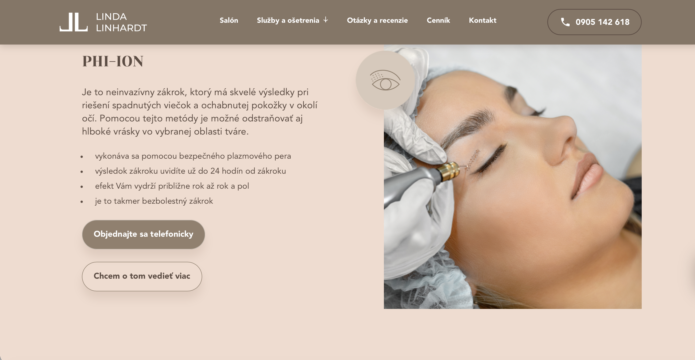
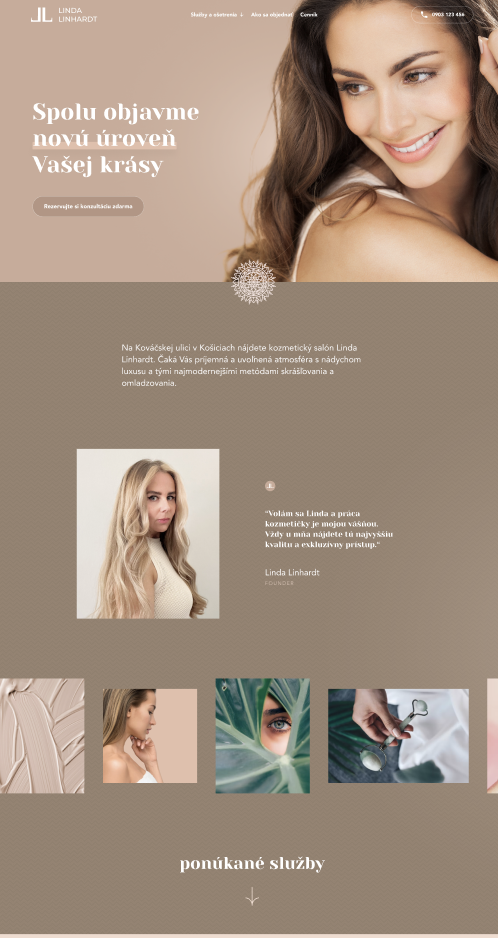

# ✨ Designing a calm & elegant beauty experience  
### *Linda Linhardt Beauty Homepage*

⬇️ **Full website preview at the end of the case study**

---

## 🌿 Overview

This project is a homepage design for **Linda Linhardt Beauty**, focused on elegance, clarity, and a premium beauty experience.

The goal was to create a website that feels calm, modern, and visually clean while reflecting the identity of a luxury beauty brand.

Users should instantly understand the brand and naturally explore products and services.


---

## 💭 Problem

Many beauty websites feel overwhelming.

Too many products.  
Too much information.  
Too many competing visuals.

Instead of feeling premium, the experience often becomes confusing.

Users can struggle with:

- Unclear navigation  
- Too much visual clutter  
- Weak brand storytelling  
- Difficulty finding key information  

> *“Beauty should feel effortless — the website should too.”*

---

## 🎯 Design Goal

The goal was to design a homepage that feels:

✨ Elegant  
🌿 Minimal  
🤍 Trustworthy  
🧴 Premium  
📱 Easy to navigate  

The focus was on creating an experience that feels soft, modern, and visually balanced.

### The design focuses on:

- Reducing visual clutter  
- Improving content hierarchy  
- Strengthening brand identity  
- Creating a smooth browsing experience  
- Making key actions feel intuitive  



---

## 🎨 Visual Direction

The visual direction was inspired by luxury skincare and beauty brands.

I focused mainly on:

- 🤍 Soft neutral tones  
- 🫧 Clean spacing  
- 📸 Premium imagery  
- ✍️ Elegant typography  
- 🪞 Editorial-inspired layouts  

The goal was to create a calm and elevated feeling throughout the experience.

---

## 🛠️ Design Process

```text
🌱 Research → 🧩 Structure → ✏️ Wireframes → ✨ Final UI
```

---

## 🔍 Research

The first phase focused on understanding common problems in beauty websites and identifying user expectations.

### Key findings:

- Users need quick orientation  
- Homepage sections should feel easy to scan  
- Products should remain visually clear  
- Hierarchy is essential for trust  

This phase helped define the UX direction of the project.

---

## 🗂️ Structure

After research, I defined the homepage structure and content flow.

This included:

- Hero section planning  
- Content hierarchy  
- Navigation structure  
- CTA placement  
- Section organization  

### Objective:

> **Less chaos. More clarity.**



---

## ✏️ Wireframes & Content Structure

Before designing the final interface, I created low-fidelity wireframes to test spacing and content hierarchy.

This phase helped define:

- Visual rhythm  
- Content priorities  
- Section spacing  
- User flow  
- CTA visibility  

The wireframes ensured that the final design stayed clean and easy to navigate.


---

## ✨ Final UI

The final homepage focuses on simplicity and elegance.

### Key improvements:

✔️ Cleaner visual hierarchy  
✔️ Stronger brand presentation  
✔️ Reduced visual noise  
✔️ Smoother user flow  
✔️ More premium overall feeling


---

## 💡 Reflection

This project helped me better understand how simplicity can strengthen a brand experience.

### I learned how to:

- Structure content more intentionally  
- Create stronger visual hierarchy  
- Guide users through design  
- Balance aesthetics with usability  

I also realized that beauty websites don’t need complexity — clarity creates trust.

If I continued this project, I would test the design with real users and further improve mobile responsiveness.


---

### 🖤 Thank you for viewing the project.
*Designed & created by Jasmin Linhardt*
