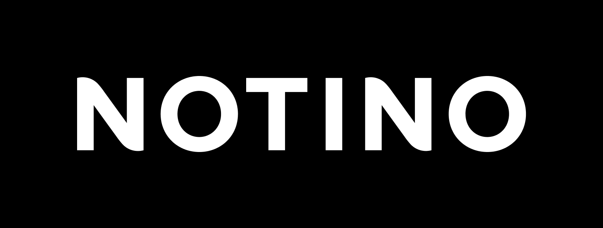
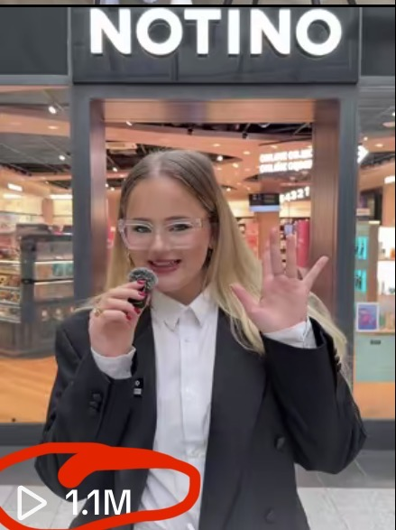
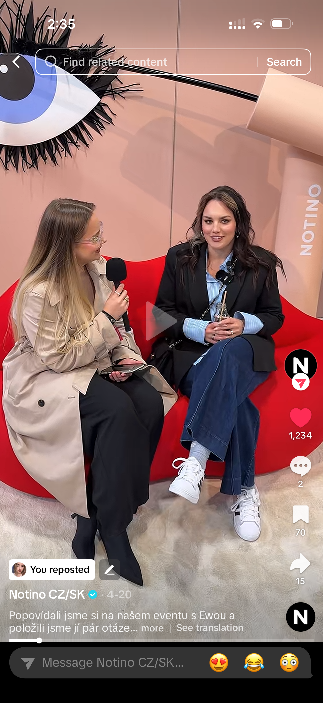
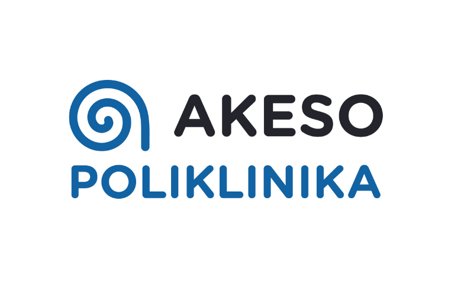

# 💄 From Makeup to Marketing

## ✨ My story

My story is called **From Makeup to Marketing.**

From makeup…  
to marketing.  
And from filming videos in my room…  
to becoming a UGC creator and TikTok ambassador for Notino.

I want to share how something I’ve always loved slowly turned into my job, and how I went from creating makeup tutorials just for fun to working with brands and building content professionally.

But let me take you back to the beginning.

---

## 🌸 Where it all started

I grew up around beauty.

My mom is an **esthetician**, so I spent a lot of time in her salon when I was younger.  
Makeup, skincare, clients, products… it was part of my everyday life.

For me, beauty wasn’t something I discovered online.  
It was something I grew up with.

And I naturally fell in love with it.

---

## 🎥 First steps

I started doing makeup really early and I used to film small makeup tutorials just for myself.

Not for views, not for attention, not for money. Just because I enjoyed it.

It was just me, my camera, and creativity.

---

## 📱 The shift to social media

But then social media started growing, especially TikTok.

And I slowly realized that what I was doing for fun could actually become something bigger.

That’s how I got into UGC — user generated content.

At first, it still felt natural. I was just creating, testing ideas, and exploring what works.

But then Notino noticed my work.

---

## 🌍 First big opportunity

They reached out and gave me a chance.

At the beginning, it was mainly beauty content — makeup, skincare, product videos.

But then something changed.

My videos started performing really well, sometimes even better than others, even without paid promotion.

And that’s when everything started to grow.

---

## 🚀 Growth & new opportunities

From makeup content…  
to skincare campaigns.  
From product videos…  
to event coverage.  
From creator…  
to ambassador.

I started attending events, meeting people, and creating content from completely different perspectives.

Recently, I even did an interview with **Ewa Farna** — which still feels a bit unreal when I think about where I started.

  

---

## 🎬 What I do now

Today, I don’t only work with Notino anymore.

I also collaborate with other brands where I do UGC content, visuals, and marketing strategy.

Most of the time, I’m behind the camera rather than in front of it.

For example, I work with **Poliklinika AKESO**, which is part of the **Akeso Holding healthcare group**.

There, I create not only UGC content, but also:

- 🎨 Graphic design (banners, social media posts, visual materials)  
- 📲 Content creation for social media  
- 📊 Marketing strategy & creative direction  

And through all of this, I realized something important.

---

## 💡 Realization

I don’t just create videos.

I create how brands communicate online.

---

## 🔄 The reality of the industry

But I also understand something else.

This industry is constantly changing. Trends shift, platforms evolve, and nothing stays the same for long.

And because of that, I know this probably won’t be my final destination.

---

## 🧭 Future plans

In the future, I definitely want to build my own business.

Because if I can help other brands grow through marketing…  
then I want to do the same for myself.

To create something that is mine.  
Something that reflects me completely.  
Something I build from the ground up.

---

## 🌟 What I learned

So what did I learn from this journey?

**One:** what you love doing for fun can become your career.  

**Two:** you don’t always need a perfect plan — sometimes you just start, and it grows with you.  

**Three:** your background, even the things you don’t think matter, can shape your biggest opportunities.  

---

## 💭 Final thought

And maybe that’s the point of my story.

It was never just about makeup.  
It was about turning something I grew up with… into something I can grow into.

---

## 💄 From makeup… to marketing.
