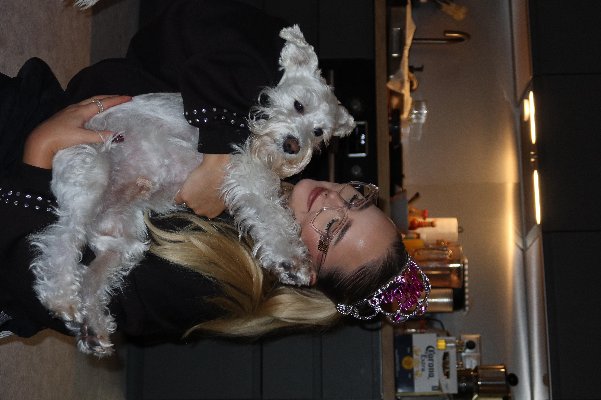

# About me
My name is Jasmin, and I am a freelance creative from Košice, Slovakia, currently living in Prague, where I have been for the past four years. I moved to Prague to study, starting at the University of New York in Prague, and after one year I decided to continue my studies at VŠKK, which felt like a better match for my creative goals.

I work as a freelancer in graphic design, social media marketing, and video creation and editing. I help brands create clear and engaging visual content, including graphic design, social media content, and videos. I currently work with clients such as Notino and Poliklinika Akeso, creating content that supports their communication and marketing.

Creativity has always been an important part of my life. I have been singing and playing the piano since I was young, attending art lessons since the age of four, and dancing since I was six. Growing up surrounded by music and art is the reason why I feel such a strong connection to creativity and design today.

This is me and Yeti:

I also love makeup and fashion, which is why working with Notino is a dream job for me. It allows me to combine my personal interests with my professional work. In my free time, I enjoy reading classic books such as Jane Eyre and Pride and Prejudice, and I am currently reading The Picture of Dorian Gray. When I am not working or reading, I spend time with my dog Yeti, who has been with me for three years.

