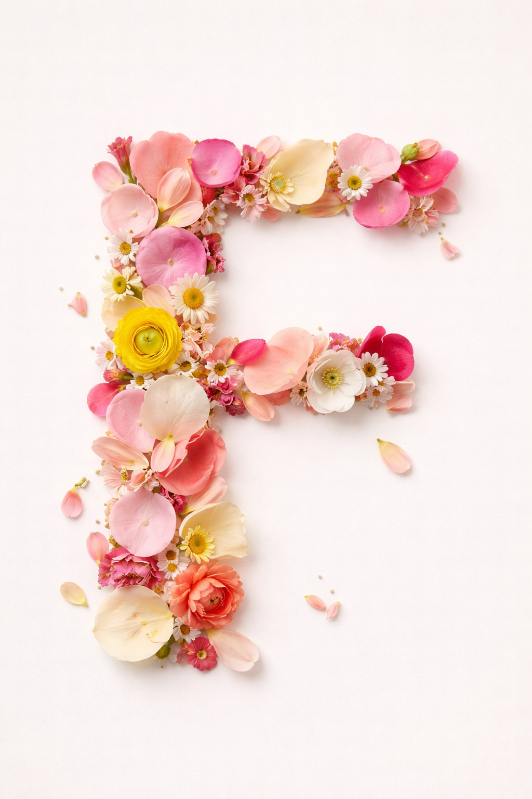

# How I designed my Bespoke Character 🌸

For this assignment I decided to use one of my favorite things, flowers :) I used AI and generated an image, since it's a powerful tool if you know how to use it right. 

I chose the letter F, because I want to use it for the next assignment to make a poem about flowers. The "F" is made from colorfoul flower petals. 

I really like it. 

